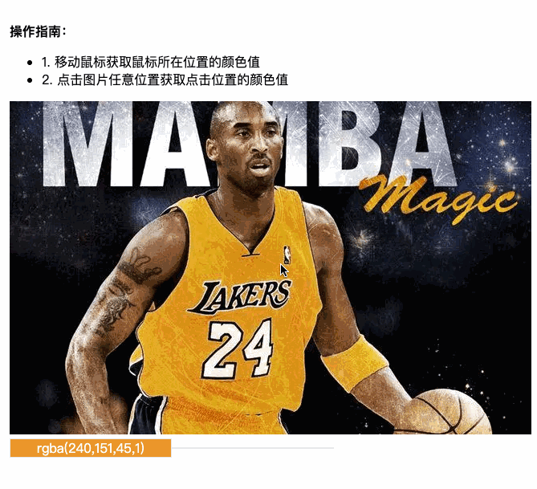
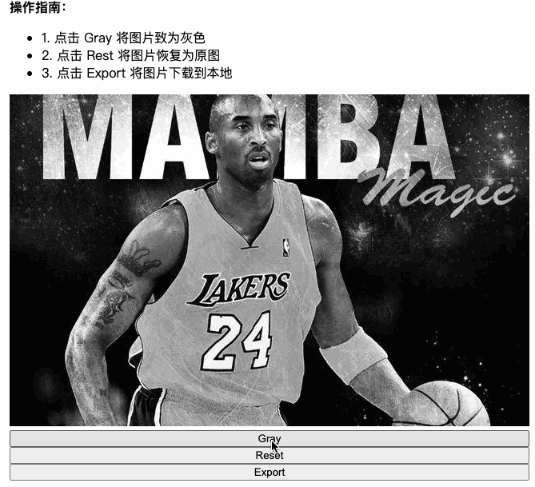
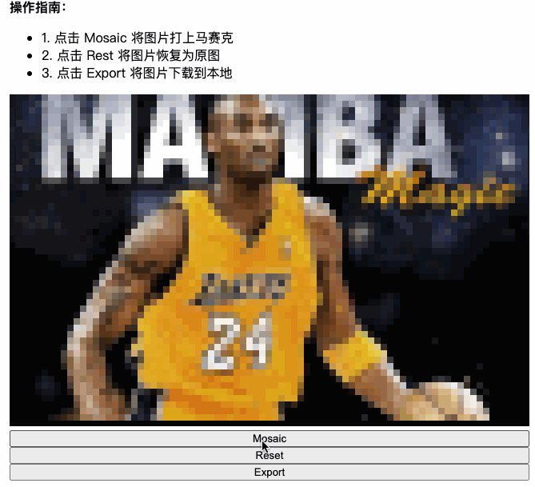

# 图片处理进阶 Demo

从事音视频行业数年，将一些工作所得与大家分享。

Demo 主要由浅入深一步一步的引导大家对图片处理的理解，包括大家也可以集思广益将你们有意思的 Demo request&pull 给我。

> 如果看不懂没有关系，大家主要先有一个概念，后续去 MDN 上查找相关资料自学即可。也许 Demo 看着看着你就懂了。

大家可以按照一下顺序体验 Demo，来消化理解这里面的知识：

- 获取图片任意像素点的颜色值
  
- 将图片致灰 & 下载图片
  
- 给图片添加马赛克 & 下载图片
  
- 获取摄像头，然后给视频加上各种滤镜或者将视频打上马赛克（待更新）
- 解锁更多（AI 玩法....）

了解更多：

- [掘金](https://juejin.cn/user/3421335914811086)
- [GitHub](https://github.com/chudongvip)
